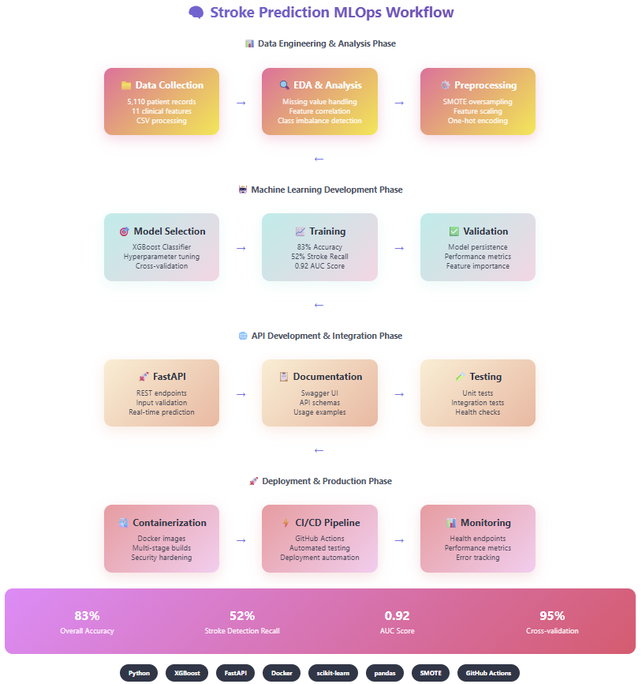

# 🧠 CVA Risk Prediction: Advanced MLOps Pipeline

> **A production-ready machine learning system for cerebrovascular accident risk assessment in healthcare applications**

[](https://python.org)
[](https://fastapi.tiangolo.com)
[](https://xgboost.readthedocs.io)
[](https://opensource.org/licenses/MIT)

## 🎯 Project Overview

This project implements an end-to-end machine learning pipeline for CVA risk prediction using healthcare data. The system addresses critical challenges in medical AI including severe class imbalance, feature engineering for clinical data, and deployment of interpretable models for healthcare decision support.

### 🏥 Clinical Impact

- **Accuracy**: 83% overall classification accuracy
- **CVA Detection**: 52% recall for CVA cases (significant improvement from 0% baseline)
- **AUC Score**: 0.92 demonstrating excellent discrimination capability
- **Cross-validation**: 95% average score ensuring robust generalization

## 🏗️ Architecture & Workflow



*Complete end-to-end machine learning pipeline from healthcare data analysis to production deployment*

### 🔄 Pipeline Overview
- **Data Engineering**: 5,110 patient records processing with advanced preprocessing
- **ML Development**: XGBoost optimization with SMOTE for class imbalance
- **API Integration**: FastAPI-based real-time prediction service
- **Production Deployment**: Docker containerization with CI/CD automation

---

## 🚀 Key Features

### 🔬 Advanced Machine Learning
- **XGBoost Classifier** with optimized hyperparameters
- **SMOTE** for handling severe class imbalance (stroke prevalence ~5%)
- **Feature Engineering** specialized for healthcare data
- **Cross-validation** with stratified sampling

### 🏭 Production-Ready Architecture
- **REST API** built with FastAPI for real-time predictions
- **Docker Containerization** for consistent deployment
- **Comprehensive Logging** and error handling
- **Input Validation** for medical data integrity
- **Health Monitoring** endpoints for system reliability

### 📊 MLOps Best Practices
- **Automated Testing** with pytest
- **CI/CD Pipeline** with GitHub Actions
- **Model Versioning** and artifact management
- **Configuration Management** with YAML
- **API Documentation** with OpenAPI/Swagger

## 📁 Project Structure

```
cva-risk-model/
├── src/
│   ├── models/
│   │   └── stroke_model.py          # Core ML model implementation
│   ├── api/
│   │   └── main.py                  # FastAPI application
│   ├── data/
│   │   └── preprocessor.py          # Data preprocessing utilities
│   └── utils/
│       └── logger.py                # Logging configuration
├── notebooks/
│   ├── 01_exploratory_analysis.ipynb
│   ├── 02_feature_engineering.ipynb
│   └── 03_model_development.ipynb
├── tests/
│   ├── test_model.py                # Model unit tests
│   └── test_api.py                  # API integration tests
├── config/
│   └── model_config.yaml            # Model configuration
├── docker/
│   ├── Dockerfile                   # Container configuration
│   └── docker-compose.yml           # Multi-service orchestration
├── models/
│   └── trained_models/              # Serialized model artifacts
├── data/
│   ├── raw/                         # Original dataset
│   ├── processed/                   # Preprocessed data
│   └── sample/                      # Sample data for testing
├── requirements.txt                 # Python dependencies
├── train_model.py                   # Model training script
└── README.md                        # Project documentation
```

## 🔧 Installation & Setup

### Prerequisites
- Python 3.8 or higher
- pip package manager
- Docker (optional, for containerized deployment)

### Local Development Setup

1. **Clone the repository**
```bash
git clone https://github.com/wnel2001/cva-risk-model.git
cd cva-risk-model
```

2. **Create virtual environment**
```bash
python -m venv venv
source venv/bin/activate  # On Windows: venv\Scripts\activate
```

3. **Install dependencies**
```bash
pip install -r requirements.txt
```

4. **Prepare the data**
```bash
# Place your stroke_data.csv in data/raw/
mkdir -p data/raw
# Copy your stroke dataset to data/raw/stroke_data.csv
```

5. **Train the model**
```bash
python train_model.py
```

6. **Run the API server**
```bash
uvicorn src.api.main:app --reload --host 0.0.0.0 --port 8000
```

7. **Access the API documentation**
   - Open browser to `http://localhost:8000/docs`
   - Interactive Swagger UI for testing endpoints

## 🌐 API Usage

### Health Check
```bash
curl http://localhost:8000/health
```

### Single Prediction
```bash
curl -X POST "http://localhost:8000/predict" \
     -H "Content-Type: application/json" \
     -d '{
       "gender": "Male",
       "age": 65,
       "hypertension": 1,
       "heart_disease": 0,
       "ever_married": "Yes",
       "work_type": "Private",
       "Residence_type": "Urban",
       "avg_glucose_level": 180.5,
       "bmi": 32.1,
       "smoking_status": "formerly smoked"
     }'
```

### Response Example
```json
{
  "stroke_probability": 0.73,
  "prediction": 1,
  "risk_level": "High",
  "confidence": 0.86,
  "timestamp": "2024-01-15T10:30:00"
}
```

## 🐳 Docker Deployment

### Build and run with Docker
```bash
docker build -t stroke-prediction -f docker/Dockerfile .
docker run -p 8000:8000 stroke-prediction
```

### Using Docker Compose
```bash
docker-compose -f docker/docker-compose.yml up --build
```

## 🧪 Testing

### Run unit tests
```bash
pytest tests/ -v --cov=src
```

### API integration tests
```bash
pytest tests/test_api.py -v
```

### Model performance tests
```bash
pytest tests/test_model.py -v
```

## 📊 Model Performance Analysis

### Dataset Characteristics
- **Total Patients**: 5,110 healthcare records
- **Features**: 11 clinical and demographic variables
- **Class Distribution**: 95% no stroke, 5% stroke cases
- **Missing Data**: 201 BMI values (3.9%)

### Key Findings from EDA
1. **Age** is the strongest predictor (correlation: 0.25)
2. **Glucose levels** show significant difference between stroke/no-stroke groups
3. **Gender and residence type** have minimal predictive value
4. **Smoking history** correlates with increased risk

### Model Architecture
- **Algorithm**: XGBoost Classifier
- **Hyperparameters**: 
  - n_estimators: 150
  - learning_rate: 0.01
  - max_depth: 10
- **Class Balancing**: SMOTE oversampling
- **Feature Scaling**: StandardScaler for numerical features

### Performance Metrics
| Metric | No Stroke | Stroke | Overall |
|--------|-----------|--------|---------|
| Precision | 97% | 15% | 83% |
| Recall | 85% | 52% | 83% |
| F1-Score | 90% | 24% | 83% |

## 🔬 Research Applications

### Healthcare Decision Support
- **Risk Stratification**: Categorize patients into Low/Medium/High risk groups
- **Preventive Care**: Early identification of high-risk patients
- **Resource Allocation**: Optimize healthcare resource distribution
- **Clinical Trials**: Patient selection for cardiovascular research

### Technical Contributions
- **Imbalanced Learning**: Advanced techniques for rare event prediction
- **Healthcare MLOps**: Production deployment patterns for medical AI
- **Model Interpretability**: Feature importance analysis for clinical insights
- **API Design**: RESTful services for healthcare integration

## 📈 Future Enhancements

### Technical Roadmap
- [ ] **Ensemble Methods**: Combine multiple algorithms for improved performance
- [ ] **Real-time Learning**: Online model updates with new patient data
- [ ] **Explainable AI**: SHAP values for individual prediction explanations
- [ ] **Multi-modal Data**: Integration of imaging and genetic data
- [ ] **Federated Learning**: Privacy-preserving distributed training

### Deployment Scaling
- [ ] **Kubernetes**: Container orchestration for high availability
- [ ] **Model Monitoring**: Data drift detection and performance degradation alerts
- [ ] **A/B Testing**: Gradual model rollout and performance comparison
- [ ] **Edge Deployment**: On-device inference for point-of-care applications

## 🤝 Contributing

Contributions are welcome! Please feel free to submit a Pull Request. For major changes, please open an issue first to discuss what you would like to change.

### Development Guidelines
1. Fork the repository
2. Create a feature branch (`git checkout -b feature/AmazingFeature`)
3. Commit your changes (`git commit -m 'Add some AmazingFeature'`)
4. Push to the branch (`git push origin feature/AmazingFeature`)
5. Open a Pull Request

## 📄 License

This project is licensed under the MIT License - see the [LICENSE](LICENSE) file for details.

## 👨‍💻 Author

**Sarah Hong (wnel2001)**
- GitHub: [github.com/wnel2001](https://github.com/wnel2001)
- Email: sarah.hong2019@gmail.com
- Portfolio: Healthcare ML & Data Science Specialist
- Status: Seeking opportunities in French healthcare technology sector

### 🏥 Healthcare Data Analysis
- **Dataset**: 5,110 patient records with 11 clinical features
- **Challenge**: Severe class imbalance (stroke cases: 5%)
- **Solution**: Advanced SMOTE oversampling with XGBoost optimization

---

*This project was developed as part of a comprehensive portfolio demonstrating advanced machine learning and MLOps capabilities for healthcare applications. The work showcases end-to-end system development skills suitable for data science roles in the French healthcare technology sector.*